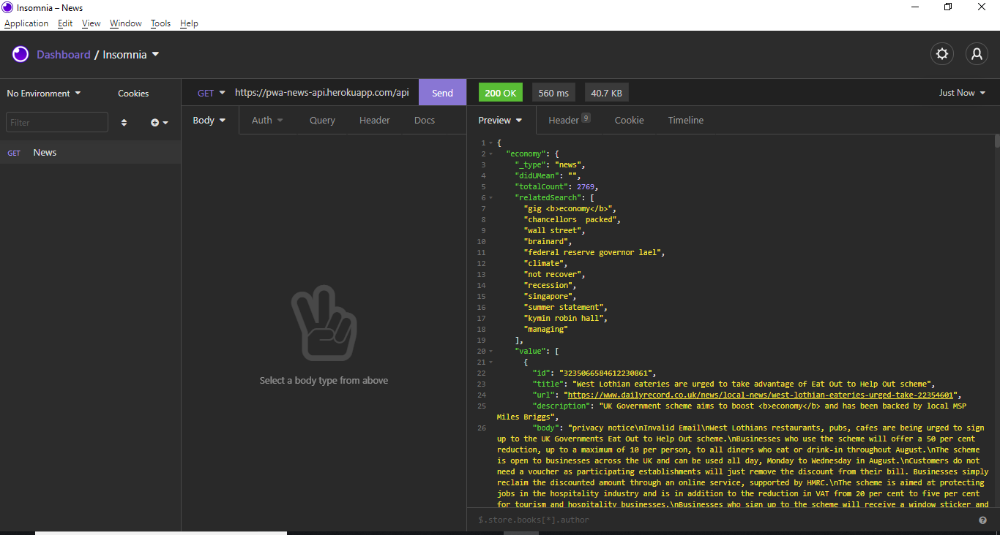

# PWA News API

This project was with Node.js. This is API newsletter.

## Getting Started

In the project directory, you can run:

### `yarn dev`

Runs the api in the development mode.\
Open [http://localhost:3333](http://localhost:3333) to view it in the console.

You will also see any lint errors in the console.

### API Endpoints

| Endpoint          | Return                               |
| ----------------- | ------------------------------------ |
| /api              | All news                             |
| /api/:subject     | All news of a subject                |
| /api/:subject/:id | A news of a subject with specific id |

 

### Deploy on Heroku

The project is deployed at the following link: [PWA News API](https://pwa-news-api.herokuapp.com/api)
